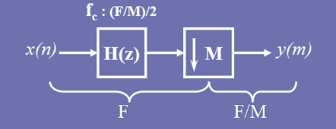
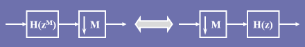
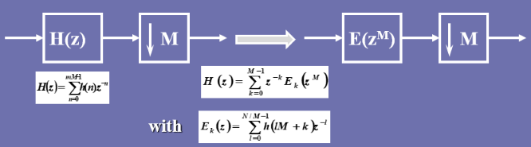
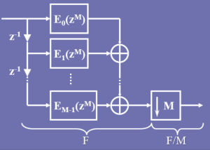
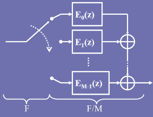
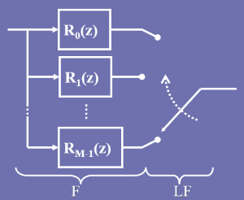

# Polyphase FIR filter for sample rate converter

Polyphase  filter is an efficient structure for applying resampling and filtering to the signal. It is also useful in filter banks processing. A typical polyphase can be showed as below:

Assume that a `N-1 th` FIR filter is $H(z)$ , if we want to split the filter into **M** bands, then $H(z)$ can be rewrote as:
$$
H(z) = \Sigma_{n=0}^{n=N-1}{h(n)*z^{-n}}=\Sigma_{k=0}^{k=M-1}z^{-k}*E_k(z^M)\\E_k(z)=\Sigma_{l=0}^{l=N/M-1}h(M*l+k)*z^{-n},k=[0,M-1]
$$
Now the FIR filter $H(z)$ has split into `M` bands, the system function of sub-band filter is $E_k$, that is the polyphase structure equivalence transformation.

As we know that for a sample rate conversion, if we want to upsample the signal from F to `I`*F, we need to interpolate the input sample `I`times. If a down-samplerate from F to F/`M` is required , we should decimated every M samples. Moreover, a low-pass filter is needed to avoid the frequency aliasing in the processing.

For example:



As the noble identity,




So look at the formula (1), we here replace the $H(z)$ with a polyphase structure ,






Applying decimation before filter to decrease the operators:



For a interpolation, it can be showed as below:




Turn into the code, you can find the polyphase filter in the file *fir.h*, here is a simple unit test for the polyphase which convert 96 kHz signal to 48 kHz for decimation, and interpolate the signal from 48 kHz to 96 kHz.

```c++
...sineGenerator()...
... output2File()...
void polyphaseFilterUnittest() {
	size_t fs = 96000;
	float* x96 = sineGenerator(1000, 1, 1, fs);
	PolyphaseFilter* p = newPolyphaseFilter(FIR_96_48, 2, FIR_96_48_24);
	float* y96 = (float*)malloc(sizeof(float) * fs
	// test case 1: 96k->48k	|	2:1
	// Use the polyphase decimation,M		|| test pass
	for (size_t n = 0; n < fs; n+=2)
	{
		runPolyphaseDecimation(p, x96+n, y96+n/2, 2);
	}
	output2File("96 to 48.txt", y96, fs / 2);

	// test case 2: 48k->96k	|	1:2
	// Use the polyphase interpolation,L	|| test pass
	memset(y96, 0, sizeof(float) * fs);

	float* x48 = sineGenerator(2000, 1, 1, 48e3);
	for (size_t n = 0; n < 48000; n++)
	{
		runPolyphaseInterpolation(p, x48 + n, y96 + n*2, 2);

	}
	output2File("48 to 96.txt", y96, fs);

	free(x96);
	free(y96);
	freePolyphaseFilter(p);
}
```

